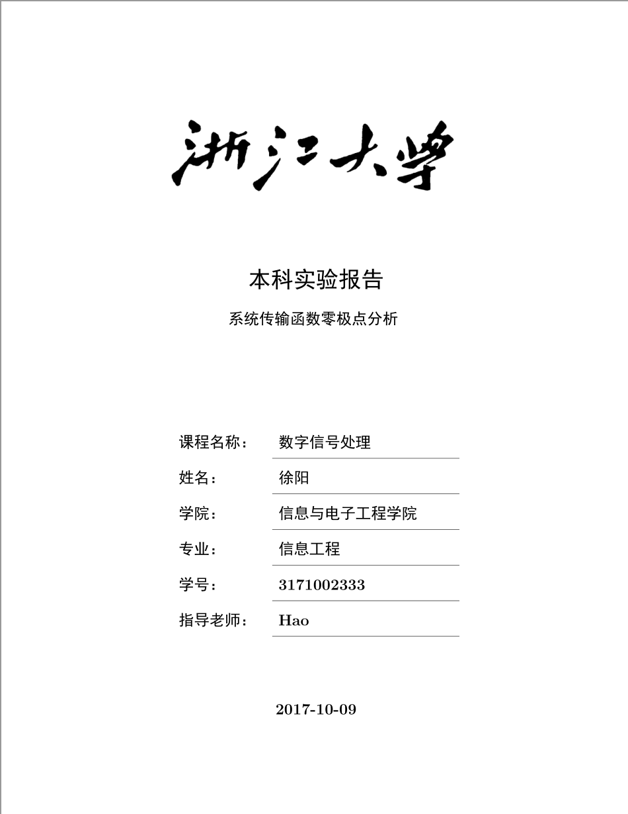
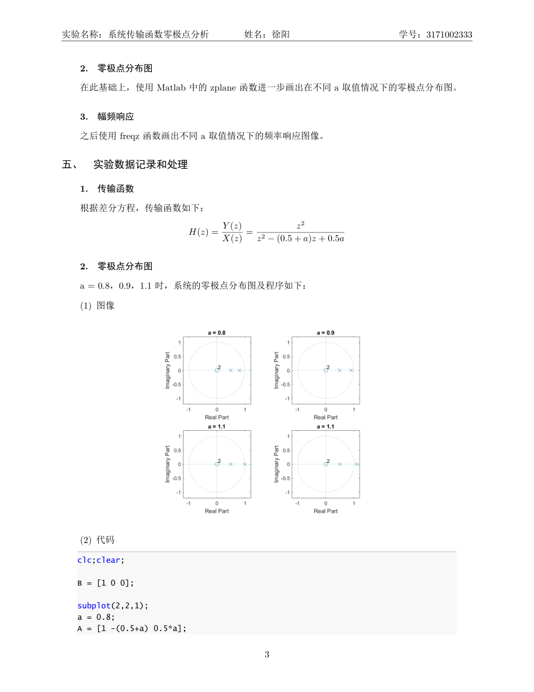

# 浙江大学实验报告模板

A LaTeX template of report in required format in ZJU (most cases).

## Usage

Just follow the template and compile.

Only tested on TexLive 2017, Windows 10, xelatex.

```bash
latexmk --xelatex report.tex
```

Or

```bash
xelatex report.tex
```

## To do

- ~~Add a cover~~

## Screenshots




